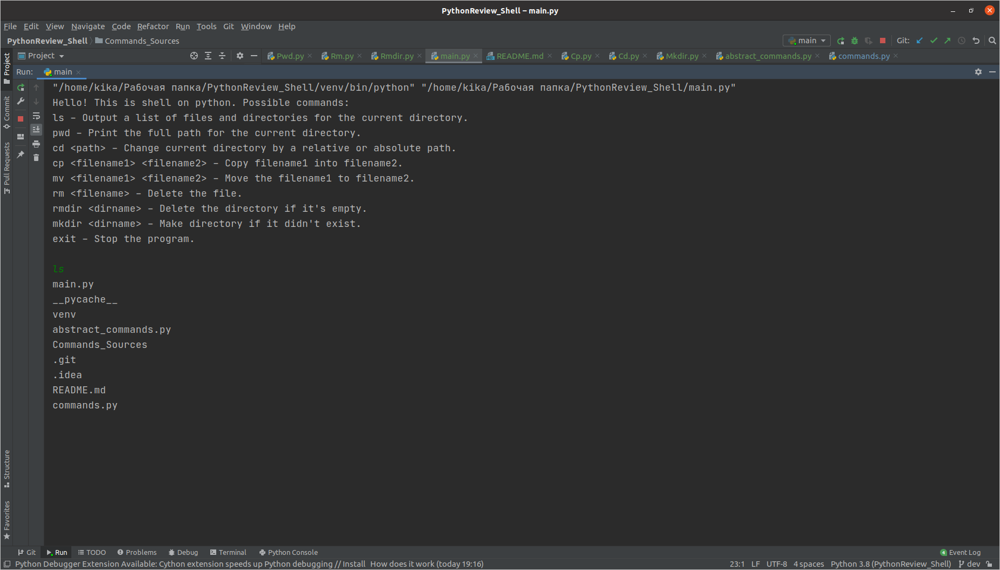
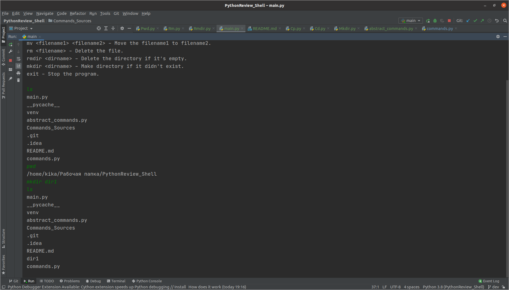
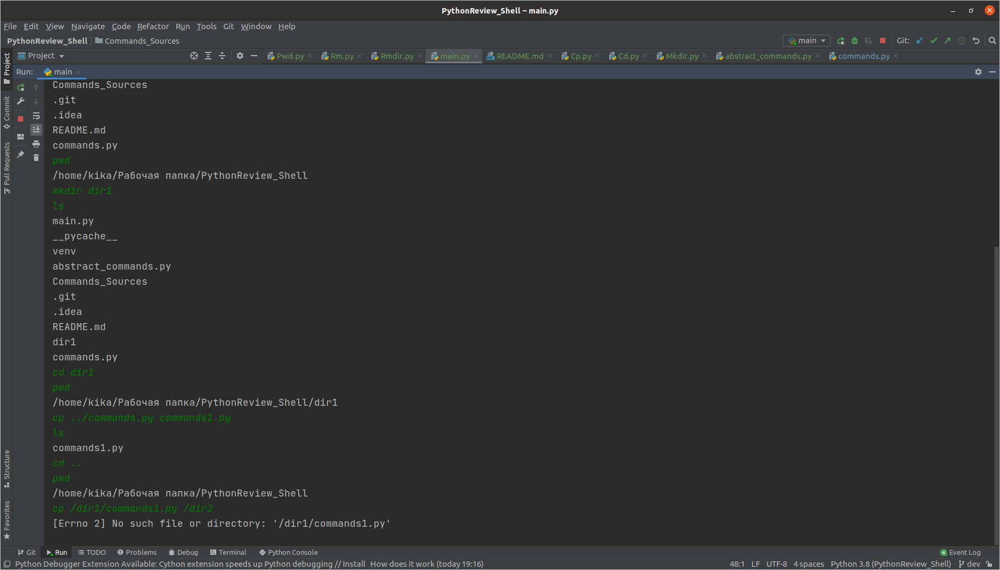
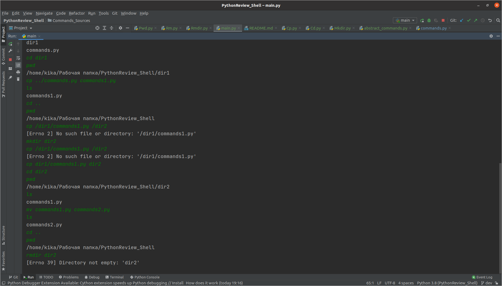
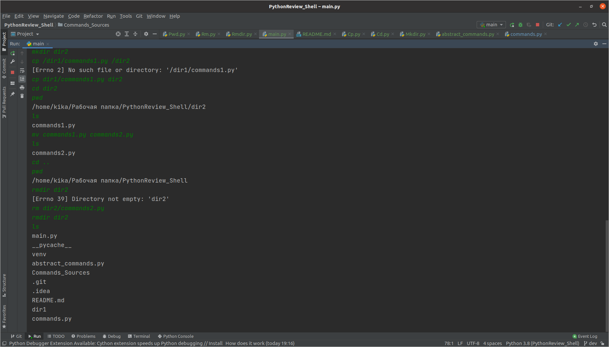
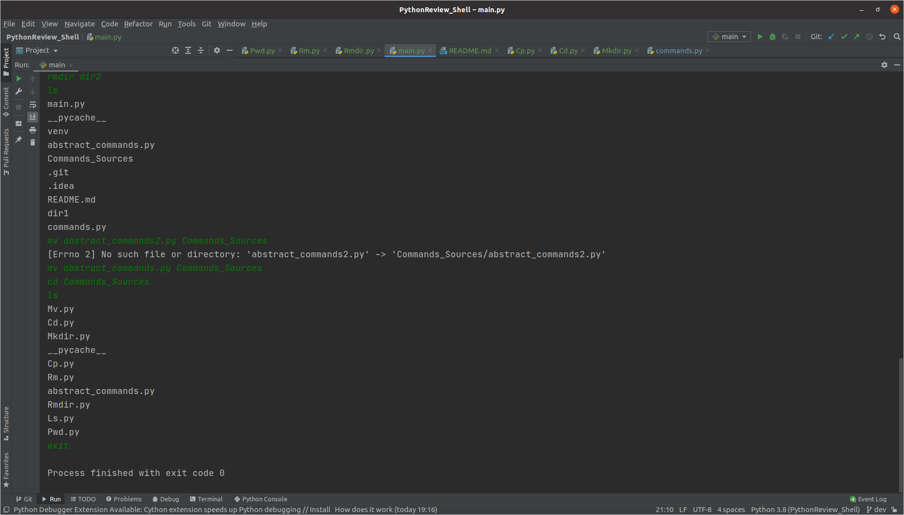

## PythonReview Shell

### **Possible commands:**

ls - Output a list of files and directories for the current directory.

pwd - Print the full path for the current directory.

cd path - Change current directory by a relative or absolute path.

cp filename1 filename2 - Copy filename1 into filename2.

mv filename1 filename2 - Move the filename1 to filename2.

rm filename - Delete the file.

rmdir dirname - Delete the directory if it's empty.

mkdir dirname - Make directory if it didn't exist.

exit - Stop the program.

## Examples of using the program

## How to install and run in PyCharm

1) Open or create a project
2) run in Terminal: git clone https://github.com/kirixh/PythonRewiew_Shell.git -b dev
3) Open main.py -> click RMB -> Run 'main'
